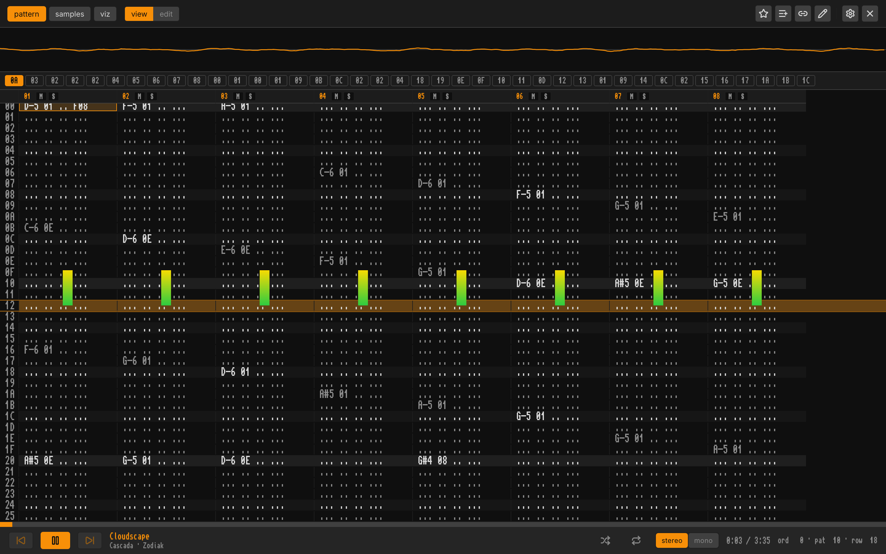
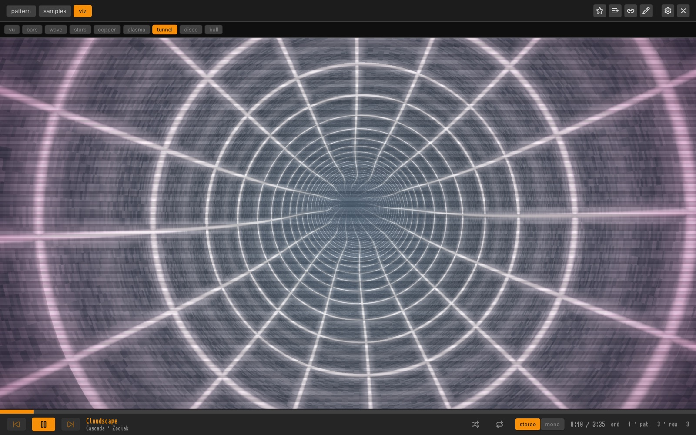
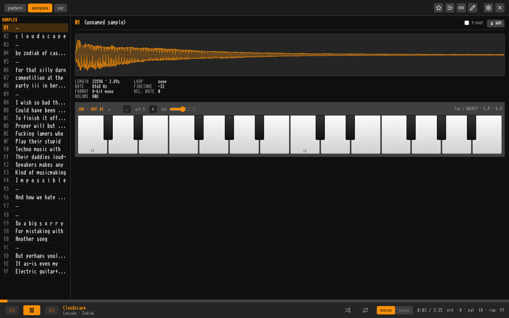
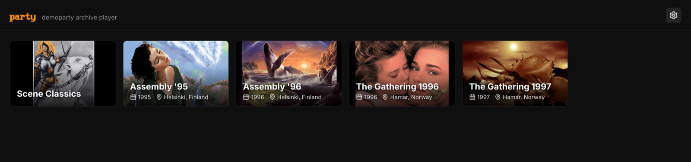
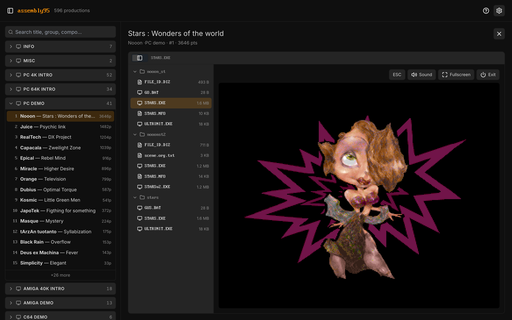

# scene

Self-hosted **demoscene archive players** — a monorepo of small web apps for
browsing and playing a personal collection of scene content. Each app is a Rust
(axum) backend that embeds and serves a SvelteKit SPA and ships as a tiny
container; shared frontend code lives in `packages/*`.

## Apps

- **tracker** (`apps/tracker`) — a FastTracker 2–style player for a filesystem
  collection of tracker modules (MOD/XM/S3M/IT and the legacy zoo). Browse by
  group/artist/format, play in-browser via libopenmpt (WASM), with a live
  pattern view, playlists, and Modland fetch. A backend-less build also runs on
  [GitHub Pages](https://eetu.github.io/scene/): drop / pick a module (or a
  `.zip` / folder) and it plays entirely in the browser — the library, favourites
  and playlists persist locally (IndexedDB + localStorage), nothing is uploaded.
- **party** (`apps/party`) — a demoparty archive player. Browse a party's
  productions by competition, then play music, view graphics/NFOs, and **run the
  demos in the browser**: PC via js-dos, C64/Amiga via EmulatorJS. Amiga entries
  boot from per-prod disk images kept under `.support/`; PC demos get a baked
  DOSBox config (with a GUS-first sound-card hint).

**tracker** — the FastTracker 2–style pattern view, playing an 8-channel module
with the master scope and per-channel VU meters:



…plus a set of demoscene visualisers (here the tunnel) and a sample browser with
a jam keyboard that plays the module's raw sample PCM:

| tunnel visualiser | sample browser + jam keyboard |
| --- | --- |
|  |  |

**party** — the landing page, one card per archived demoparty (logos are each
party's winning graphics entry):



…and the productions themselves run in the browser — here Nooon's _Stars: Wonders
of the World_ (Assembly '95, 1st place) booted in js-dos:



## Services

- **transcoder** (`services/transcoder`) — a Rust + ffmpeg sidecar that turns
  party media (legacy images/video) into browser-native formats on demand.
  Separate runtime, reached only over loopback HTTP with a bearer token.

## Layout

```text
packages/        shared FRONTEND libs (yarn workspace, source-only)
  player/          @scene/player  — libopenmpt engine + transport UI
  design/          @scene/design  — halo design tokens, fonts, theme
apps/
  tracker/{backend,frontend,e2e}
  party/{backend,frontend,parties}
services/
  transcoder/      ffmpeg sidecar (own image)
Cargo.toml         one Rust workspace (all backends + e2e + transcoder)
package.json       one yarn workspace (packages/* + apps/*/frontend)
justfile           task runner
```

**Two workspaces, one repo:** frontends use yarn (Berry, vendored — no global
yarn needed); backends are one cargo workspace sharing a single `Cargo.lock` and
`target/`. Shared packages export raw `.svelte`/`.ts`; the consuming app's Vite
transpiles them (no build step in `packages/*`).

## Develop

Prerequisites: a Rust toolchain, Node (pinned in `.node-version`), and
[`just`](https://github.com/casey/just) + [`bacon`](https://github.com/Canop/bacon).
Yarn is vendored in the repo, invoked via node — nothing global to install.

```sh
just install            # install JS workspace deps
just dev tracker        # run a whole service: backend (bacon) + frontend (vite) + sidecars
just dev party          # …party also starts the transcoder sidecar
just build              # all frontends + the whole rust workspace
just lint               # yarn lint/format + cargo clippy (workspace)
just test               # cargo test (workspace)
```

Backend dev reads each app's `backend/.env` (copy from `backend/.env.example`).
`DEV_AUTH=1` (or `<APP>_OPEN=1`) bypasses the edge forward-auth locally;
`PARTY_KIOSK=1` makes a party instance read-only/public.

## Deploy

CI publishes one multi-arch (amd64 + arm64) image per service to GHCR:
`ghcr.io/eetu/scene-{tracker,party,transcoder}`. The apps run behind
oauth2-proxy forward-auth and are deployed to a Raspberry Pi via the `../raspi`
(pyinfra) repo.

The party **content** is large and not in the repo, so it ships as a separate
read-only data image built by hand from the NAS-mounted tree:

```sh
just package-party-data /Volumes/scene/parties Assembly95 1995
# → ghcr.io/eetu/scene-party-data-assembly95:1995
```

Adding a new party (scrape from scene.org → lay out → index → package) is a
runbook: [apps/party/parties/README.md](apps/party/parties/README.md).

## Licensing

This repository's own code has no license declared (personal project). It
bundles and serves third-party emulators (EmulatorJS, js-dos), the libopenmpt
audio engine, and fonts, each under its own license — see
[THIRD_PARTY_NOTICES.md](THIRD_PARTY_NOTICES.md). No Amiga Kickstart ROM is
distributed; the emulator falls back to the free AROS ROM.
